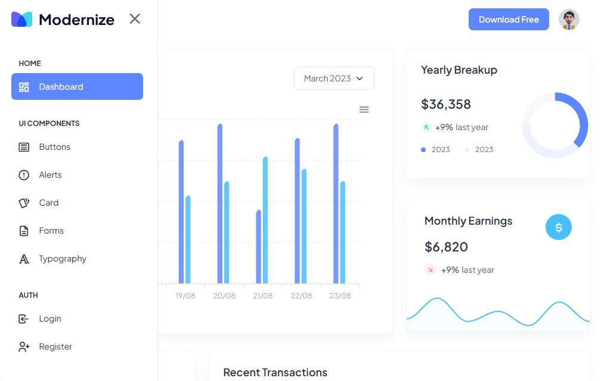

# Modernize Dashboard

A modern and responsive admin dashboard interface designed to provide a clean and intuitive experience for monitoring analytics, earnings, transactions, and other key business metrics.

## ✨ Features

- 📊 Interactive dashboard with analytics
- 💰 Yearly and monthly earnings overview
- 📈 Data visualization and charts
- 💳 Recent transactions section
- 🧩 Reusable UI components
- 🔐 Authentication pages
- 📱 Responsive design
- 🎨 Clean and modern UI

## 🛠️ Technologies

- HTML5
- CSS3
- JavaScript
- Chart.js
- Responsive Design

## 📸 Preview



## 🚀 Getting Started

Clone the repository:

```bash
git clone https://github.com/nongoantonio/Modernize.git